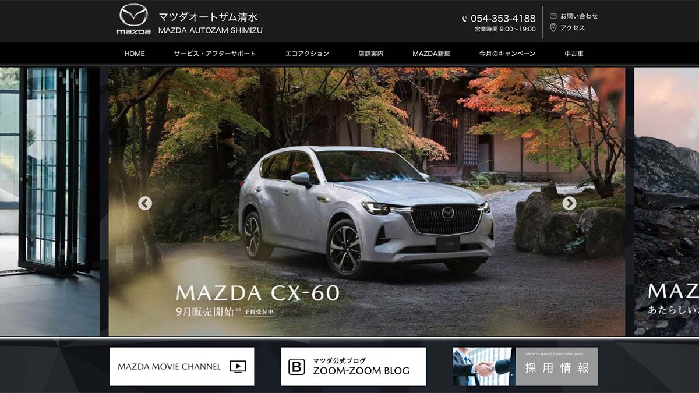

# MAZDA SPA with Webpack (Custom Webpack Configuration)

<!-- Image -->

[Website](https://mazda.kazu-dev.com/)

This project is built before React VITE emerged and using React and custom Webpack configuration. 
The project is a single page application (SPA) that displays the Mazda car models.
Fully responsive and mobile-friendly.

## Prerequisites
Before running this project, make sure you have Node.js installed on your system.

## Installation

To get started with the Anime API & Firebase project, run the following commands:

```bash
npm install
```

## Running the project
```bash
npm start
```

## Languages & tools
- [React](https://reactjs.org/)
- [Webpack](https://webpack.js.org/)
- [Sass](https://sass-lang.com/)
- [Babel](https://babeljs.io/)


